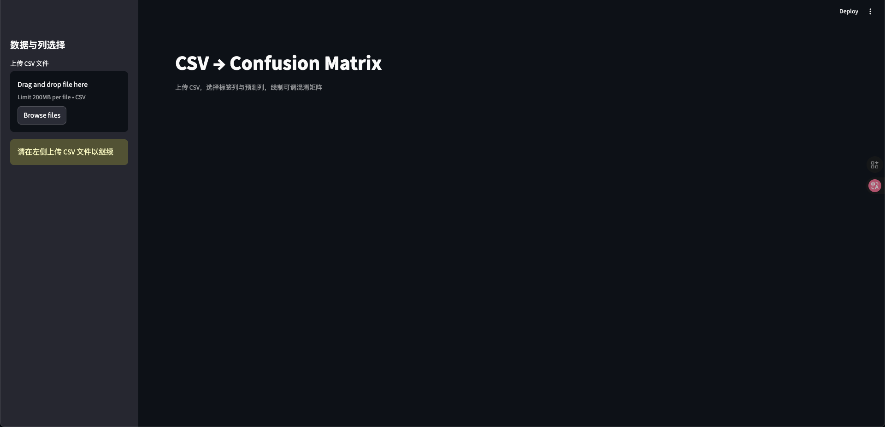
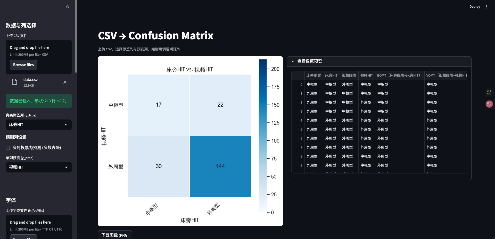

# CSV 到 混淆矩阵 (Streamlit 工具)

此工具使用 Streamlit + seaborn + scikit-learn，从 CSV 数据绘制可配置的混淆矩阵
- 必须通过页面上传 CSV（不再预读本地 `data.csv`）
- 选择真实标签列与预测列，或启用多列多数投票
- 可调参数：
  - 标签顺序/子集、归一化方式、注释开关与格式
  - 色图 (cmap，默认 Blues)、颜色条开关、色值范围、网格线宽与颜色
  - 图像尺寸、轴标签旋转、字体缩放、下载 PNG（可自定义 DPI）
- 轴方向切换：
  - 行=真实 (y_true), 列=预测 (y_pred) — 标准
  - 行=预测 (y_pred), 列=真实 (y_true) — 转置
- 自定义标题：图标题、X/Y 轴标题
- 中文字体：
  - 仅使用本地 `fonts/` 中的字体（可上传 `.ttf/.otf/.ttc`）
  - 侧栏可选择优先字体，确保部署时字体一致

## 安装
在项目根目录执行：

```bash
pip install -r requirements.txt
```

## 运行

```bash
streamlit run app.py
```

首次打开需在页面左侧上传 CSV 后才能继续。

## CSV 要求
- 第一行应为列名
- 真实/预测列的值将按字符串处理
- 若使用多列投票，空值会被忽略，若出现多众数则取首个

## 目录结构
- `app.py`: Streamlit 前端与绘图逻辑
- `requirements.txt`: 依赖
- `fonts/`: 项目内置/上传的字体文件（部署端也会使用此处字体）
- `assets/`: README 截图资源

## 常见问题
- 注释格式：计数时用 `d`，归一化时建议用 `.2f`
- 标签顺序：若留空则根据数据中的出现顺序自动推断

## 截图






# 部署

该项目已经部署在[https://csv2cm.streamlit.app/](https://csv2cm.streamlit.app/)，可以直接访问。
